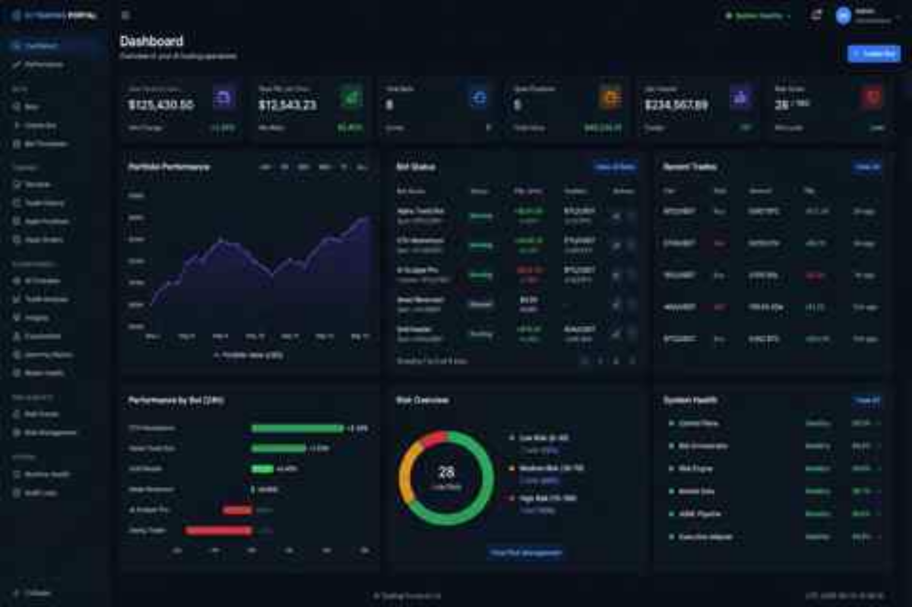

# AI Trading Portal — Dashboard Visual Proposal

## Status

`concept-only`

This image is an AI-generated visual proposal for a possible future appearance of the AI Trading Portal dashboard. It is **not** a screenshot of the current implementation, does not prove that the shown functions exist, and must not be used as delivery or acceptance evidence.

## Proposed visual direction

The concept proposes a dense, wide-screen operations dashboard with:

- persistent left navigation grouped by dashboard, bots, trading, AI/research, risk and system operations;
- a visible environment and system-health area in the top bar;
- top-level KPI cards for portfolio value, realized PNL, active bots, open positions, volume and risk;
- a portfolio-performance chart;
- a compact bot-status table with state, PNL, pair and actions;
- recent-trades and per-bot performance panels;
- a deterministic risk overview;
- a system-health summary for control, orchestration, risk, market-data, AI/ML and execution components.

## Product interpretation

The layout should be treated as a UX target, not as a literal implementation specification. Values, bots, trades, percentages and health readings visible in the concept are illustrative and fabricated for visual design purposes.

Any implementation derived from this proposal must use authoritative portal APIs and truthful states. The UI must not invent production data when a canonical read model is unavailable.

## Architecture and safety constraints

A future implementation must preserve the existing portal boundaries:

- browser traffic communicates only with the portal/BFF API;
- no direct browser path to Freqtrade, exchanges, databases or secret stores;
- exchange credentials and private runtime addresses are never rendered;
- AI signals cannot bypass deterministic risk evaluation;
- unsupported execution paths remain fail-closed;
- `simulated` and `dry_run` states remain visually distinct from any separately authorized live-capital state;
- live-capital capability is not implied by this design;
- environment and freshness indicators remain visible.

## Suggested implementation slices

1. **Dashboard composition** — responsive grid, navigation, KPI and health components using the existing design tokens.
2. **Authoritative metrics** — map only existing bot, risk, trade, performance and runtime-health read models.
3. **Charting** — add historical portfolio/performance series only after a canonical time-series query contract exists.
4. **Operational details** — add drill-down links to Bots, Positions, Orders, Trades, Risk Events and Runtime Health.
5. **Acceptance** — Playwright coverage for desktop, ultra-wide and responsive layouts, including empty, stale, denied and unavailable states.

## Non-goals

This proposal does not authorize:

- live trading or real order submission;
- model promotion;
- direct Freqtrade exposure;
- fabricated PNL or system-health evidence;
- copying the displayed sample values into production fixtures without explicit test-only labeling.
